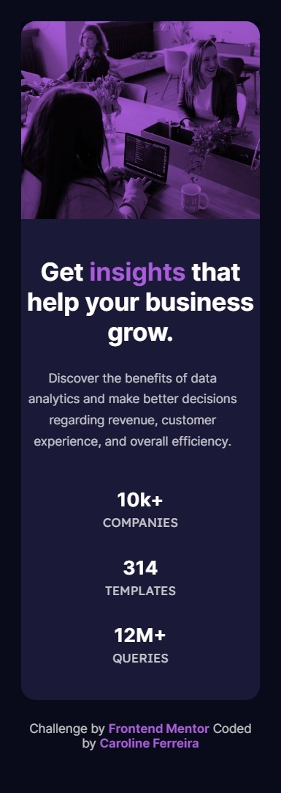
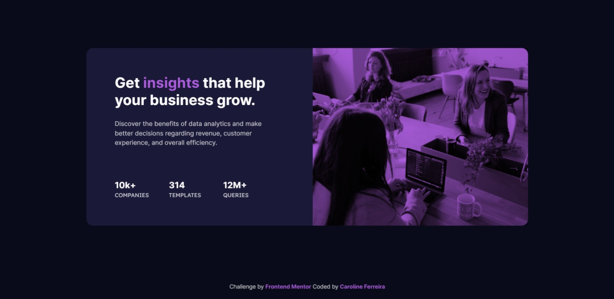

# Frontend Mentor - Stats preview card component solution

This is a solution to the [Stats preview card component challenge on Frontend Mentor](https://www.frontendmentor.io/challenges/stats-preview-card-component-8JqbgoU62). Frontend Mentor challenges help you improve your coding skills by building realistic projects. 

## Table of contents

- [Overview](#overview)
  - [The challenge](#the-challenge)
  - [Screenshot](#screenshot)
  - [Links](#links)
- [My process](#my-process)
  - [Built with](#built-with)
  - [What I learned](#what-i-learned)
  - [Continued development](#continued-development)
  - [Useful resources](#useful-resources)
- [Author](#author)
- [Acknowledgments](#acknowledgments)

## Overview

### The challenge

Users should be able to:

- View the optimal layout depending on their device's screen size.

### Screenshot

### Links

- Challenge URL: [FrontendMentor Solution](https://www.frontendmentor.io/challenges/stats-preview-card-component-8JqbgoU62/hub)
- Live Site URL: [Solution in Github Pages](https://caferreiraxd.github.io/frontendmentor-challenge/)

## My process

### Built with

- Semantic HTML5 markup
- CSS custom properties
- Flexbox
- Mobile-first workflow

### What I learned

During this small project, I was able to put into practice my newly acquired skills with HTML and CSS. In addition, I also managed to apply the studied concepts of UI/UX. I recreated the project design in Figma and used it to assist me in creating all the code.

## Author

- Website - [Caroline Ferreira](https://github.com/caferreiraxd)
- Frontend Mentor - [@str4ce](https://www.frontendmentor.io/profile/str4ce)
- Instagram - [@caferreiraxd](https://www.instagram.com/@caferreiraxd)

